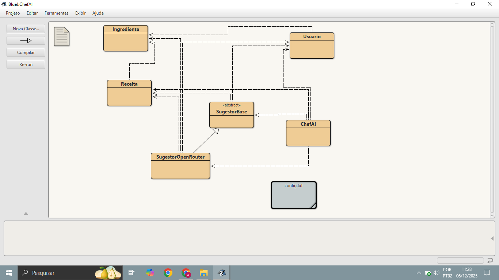

# ChefAI - Sugestor de Receitas Inteligente
*Aluna: Ana Luísa Feltrin Rauen.
*Turma: S02.

O **ChefAI** é um sistema desenvolvido em Java que utiliza Inteligência Artificial para sugerir receitas culinárias baseadas nos ingredientes que o usuário possui em casa. O projeto aplica conceitos fundamentais de Orientação a Objetos (POO) e consome APIs de LLMs (Large Language Models).

## Funcionalidades
- Cadastro de ingredientes disponíveis na despensa.
- Definição de restrições alimentares.
- Conexão com IA (via OpenRouter/Google Gemini) para gerar receitas.
- Sugestão de receitas realizáveis em até 30 minutos.

## Tecnologias Utilizadas
- **Java (BlueJ):** Linguagem principal.
- **Org.Json:** Biblioteca para processamento de respostas JSON.
- **OpenRouter API:** Para conexão com modelos de IA (Gemini/Llama/Mistral).

## Diagrama de Classes
Abaixo, a estrutura de classes do projeto, demonstrando Herança, Polimorfismo e Composição:



## 🚀 Como Executar o Projeto

### Pré-requisitos
1. Ter o **BlueJ** instalado.
2. Ter a biblioteca `json-20240303.jar` configurada no BlueJ.
3. Uma chave de API (Google Gemini ou OpenRouter).

### Passo a Passo
1. Clone ou baixe este repositório.
2. Abra o projeto no BlueJ.
3. **Configuração da API:**
   - Crie um arquivo chamado `config.txt` na raiz da pasta do projeto.
   - Cole sua chave de API (Ex: `sk-or-v1...`) dentro deste arquivo.
4. Compile o projeto.
5. Execute o método `main` da classe `ChefAI`.

## Exemplo de Uso (Console)

```text
Bem-vindo ao ChefAI - Seu Assistente Culinário Inteligente!
Digite um ingrediente (ou 'fim' para encerrar): Ovos
Quantidade: 3 unidades
Digite um ingrediente: Queijo
Quantidade: 200g
Digite um ingrediente: fim
Restrições alimentares? Não

Consultando o OpenRouter...

--- SUGESTÕES DO CHEF ---

RECEITA: Omelete de Queijo Rápida
TEMPO: 10 min
INGREDIENTES:
 - Ovos (a gosto)
 - Queijo (a gosto)
MODO DE PREPARO:
Bata os ovos, misture o queijo e frite em frigideira untada.
